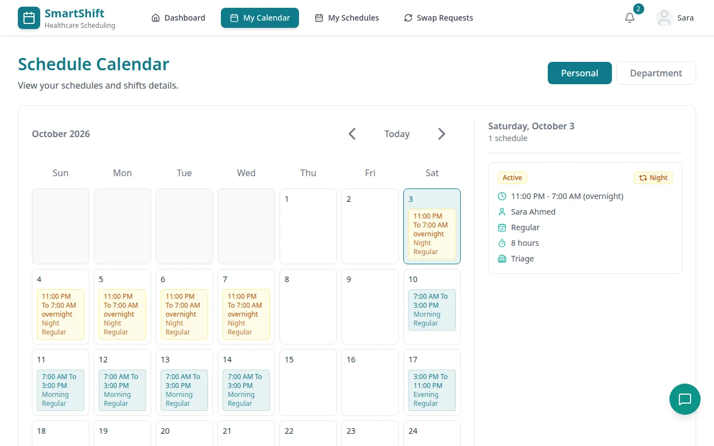
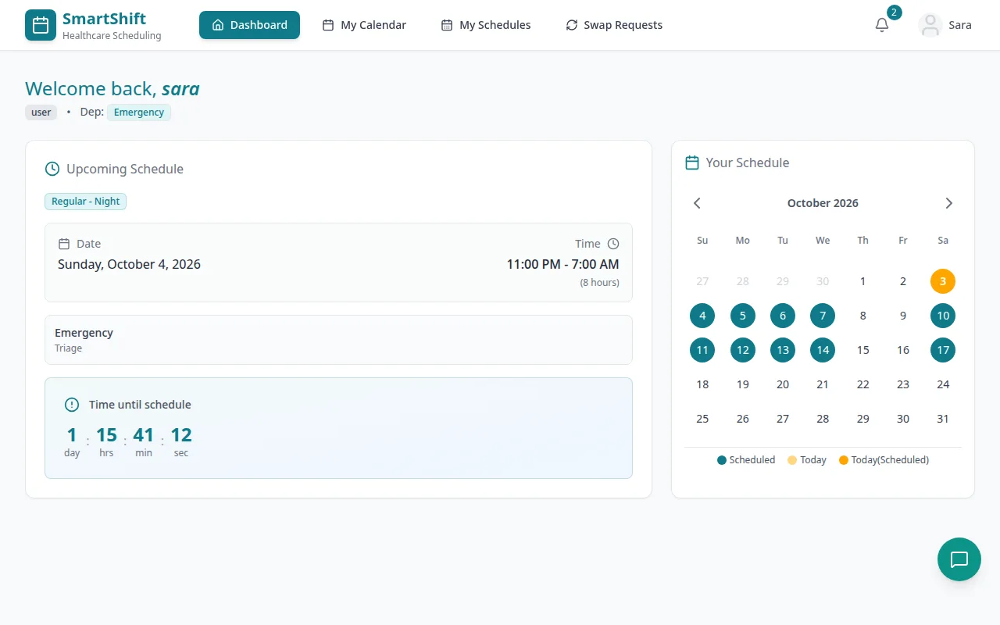
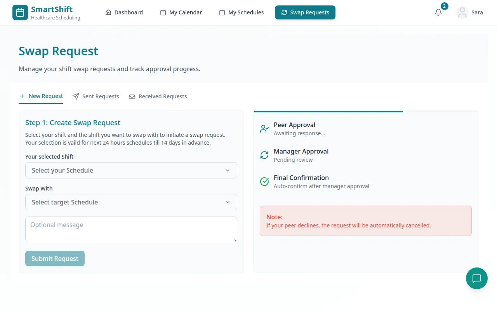
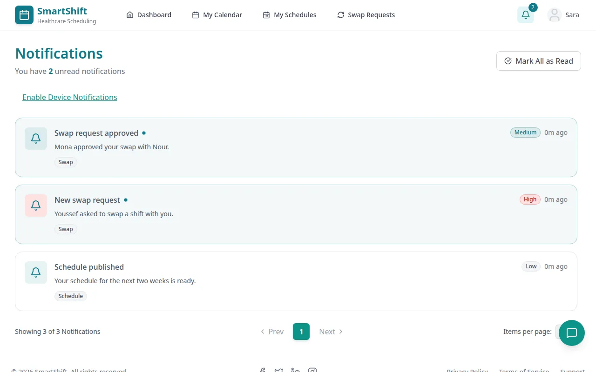

# SmartShift — Healthcare Shift Scheduling

A scheduling platform for organizations that run on shifts, built for hospitals: staff see their schedule,
swap shifts with a colleague through a two-step approval, and get notified in real time; managers and admins
maintain the org structure and shift rules.

This repository is an [Nx](https://nx.dev) monorepo with the **REST API** and the **React staff dashboard**.
The Angular admin portal lives in [hageramadan/SmartShift](https://github.com/hageramadan/SmartShift).



| Dashboard | Swap requests | Notifications |
|---|---|---|
|  |  |  |

## Features

**API** (`apps/api`: Node.js, Express, MongoDB)

- Org structure: locations, departments and sub-departments with managers, positions and levels.
- Shifts with overnight handling, per-shift position and level rules, and schedules with overlap validation.
- Shift-swap requests: the colleague accepts first, then a manager approves; history is recorded.
- JWT sessions in httpOnly cookies, roles (`user`, `manager`, `admin`), Joi validation, password reset by email.
- Notifications stored and pushed live over Server-Sent Events.
- An AI assistant endpoint (Groq) that answers questions about schedules; optional.
- Filtering, sorting and pagination shared by all list endpoints.

**Staff dashboard** (`apps/user-dashboard`: React 19, Redux Toolkit, Tailwind)

- Next shift with a countdown, monthly calendar (personal and department views), schedule list with filters.
- Create, accept and track swap requests; notifications; profile and password change.

## Running locally

Needs Node.js 20+, [pnpm](https://pnpm.io) and MongoDB (`docker run -d -p 27017:27017 mongo:7`).

```bash
pnpm install
cp apps/api/.env.example apps/api/.env.development   # then set JWT_SECRET
pnpm seed          # demo hospital: staff, shifts, four weeks of schedules, swap requests
pnpm api           # http://localhost:3000
pnpm dashboard     # http://localhost:3001
```

The seed prints the demo accounts. All use the password `Demo1234!`:

| Role | Email |
|---|---|
| Admin | `admin@smartshift.test` |
| Manager | `manager@smartshift.test` |
| Staff | `sara@smartshift.test` |

Email, S3 uploads and the AI assistant are optional; leave their variables empty to run without them.
The dashboard reads `VITE_POTRAL_API_URL` and `VITE_ADMIN_PORTAL_URL` (see `apps/user-dashboard/.env.example`);
the API allows the origins in `ALLOWED_ORIGINS`.

## Project structure

```
apps/api/src/
  controllers/  services/  dataAccess/   Request handling, business rules, queries
  models/       validators/              Mongoose schemas and Joi schemas
  routes/       middlewares/  utils/     Routing, auth and error handling, helpers
apps/api/scripts/seed.mjs                Demo data
apps/user-dashboard/src/
  pages/  components/  features/         Screens, UI, Redux slices
  services/api.jsx   config.js           Axios client and deployment settings
```

## Team

| Member | Main areas |
|---|---|
| [Montaser Ismail](https://github.com/montaser-hub) | Most of the API: auth and users, swap requests, AI assistant, shift time handling, query layer and error handling; parts of the dashboard |
| [Tarek Hamdy](https://github.com/tarekhamdy99) | Most of the React dashboard; API contributions |
| [Eslam Abbass](https://github.com/Eslam-Abbass50) | Schedules: the API service and the My Schedules page |
| [Hager Ramadan](https://github.com/hageramadan) | Angular admin portal (separate repository) |

`apps/Admin-Portal` here is only the initial Nx scaffold.

## Notes

- Configuration comes from the environment; no credentials are committed.
- The original Heroku and Render deployments are offline. The apps run locally as described above.
